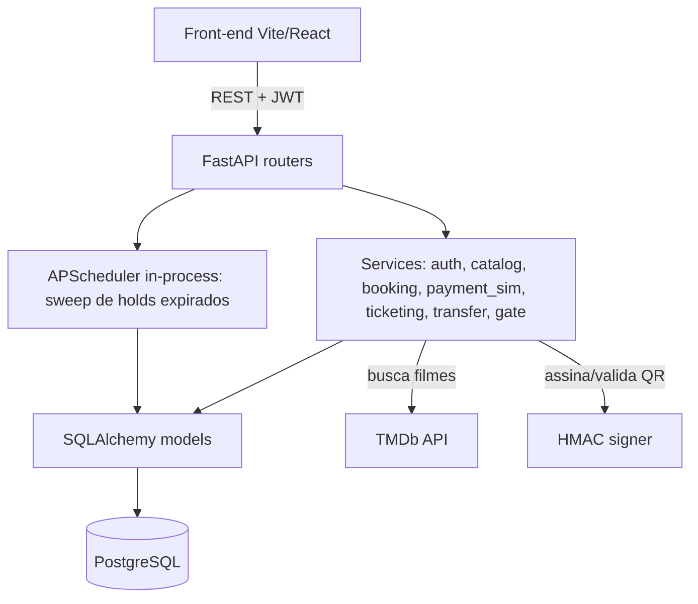
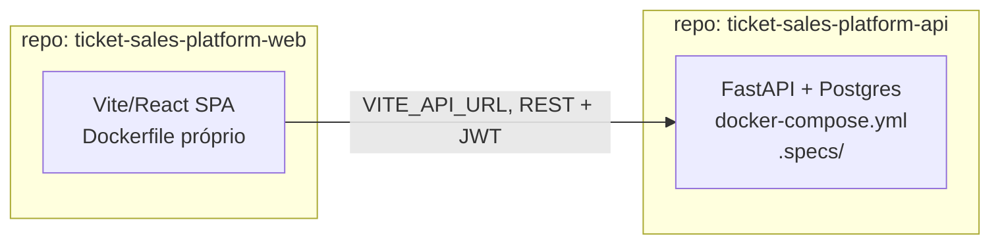

# Plataforma de Eventos e Ingressos — Design

**Spec**: `.specs/features/ticket-platform/spec.md`
**Context**: `.specs/features/ticket-platform/context.md`
**Status**: Draft — aguardando confirmação para seguir para Tasks

---

## Architecture Approach

Três abordagens consideradas, avaliadas contra a restrição real do desafio: 7 dias, um invariante crítico ("nenhum assento vendido duas vezes", "nenhum ingresso validado duas vezes") que depende de **transações atômicas simples de acertar**.

| # | Abordagem | Prós | Contras |
|---|---|---|---|
| **1 (recomendada)** | **Monólito modular em camadas** — um FastAPI, um Postgres, separação clara `routers → services → models`, sem microsserviços | Transação única no banco para os invariantes críticos (lock de assento, validação de ingresso) é trivial de garantir; Docker Compose simples (3 serviços); tempo todo investido em profundidade do fluxo, não em orquestração | Menos "arquiteturalmente vistoso" que uma solução distribuída — mas não é isso que o desafio pede |
| 2 | Hexagonal/Ports & Adapters completo (domínio isolado de FastAPI/SQLAlchemy por interfaces abstratas) | Testabilidade de domínio mais pura, mais "livro-texto" | Boilerplate extra (interfaces, DI containers) sem ganho prático nesse tamanho de projeto; risco real de "pedaço sofisticado com tela pela metade" — a própria dica do PDF avisa contra isso |
| 3 | Microsserviços por domínio (auth-service, catalog-service, booking-service, gate-service) | Nenhum relevante aqui | Transação distribuída pra garantir "1 assento = 1 venda" é exatamente o tipo de complexidade que o desafio não pede; overhead de orquestração consome o prazo inteiro |

**Escolha: Abordagem 1**, com uma aplicação *proporcional* da ideia da Abordagem 2: routers ficam finos (só HTTP + validação de schema), toda regra de negócio mora na camada de `services`, models são só persistência. Isso dá separação de responsabilidades visível no código sem pagar o custo de abstrações que não vamos precisar trocar (não existe "trocar o Postgres por outro banco" nesse projeto).



---

## Code Reuse Analysis

Projeto greenfield — nenhum código existente para reaproveitar. N/A.

---

## Dois repositórios (polyrepo), não monorepo

**Decisão** (registrada como `AD-004` em `.specs/STATE.md`): back-end e front-end são publicados como **dois repositórios GitHub independentes**, não uma única árvore. Cada um é autocontido — clona, sobe e roda sozinho.

- **`ticket-sales-platform-api`** (nome sugerido) — é o *sistema de registro*: carrega o domínio, o banco, o `docker-compose.yml` (sobe `db`+`api` sozinho, já com migration+seed) e o `.specs/` completo (spec, design, tasks, decisões — descreve o produto inteiro, não só o back-end, porque cross-cutting concerns como o fluxo de transferência tocam os dois lados).
- **`ticket-sales-platform-web`** (nome sugerido) — SPA Vite/React independente, fala com a API via `VITE_API_URL` (aponta pro back-end local, dockerizado, ou deployado). Seu README aponta pro `.specs/` do repo da API como fonte da verdade do produto.

Isso diverge da leitura mais literal do PDF ("um repositório público") — motivo e trade-off documentados no README de cada repo, não escondido.



---

## Estrutura de Pastas

### Repo `ticket-sales-platform-api` (raiz do repositório)

```
.
├── app/
│   ├── main.py                 # app FastAPI, CORS, routers, lifespan (scheduler)
│   ├── core/
│   │   ├── config.py           # Settings (pydantic-settings)
│   │   ├── security.py         # hashing de senha, JWT, guards de role
│   │   └── qr.py               # assinatura/validação HMAC do QR
│   ├── db/
│   │   ├── session.py          # engine, SessionLocal, get_db
│   │   └── base.py             # Base declarativa
│   ├── models/                 # mixins.py, User, Event, Seat, Ticket, TransferInvite, PaymentAttempt, FakeEmailLog
│   ├── schemas/                 # base.py (BaseReadSchema) + Pydantic por recurso
│   ├── api/
│   │   └── v1/                  # routers: auth, events, bookings, payments, tickets, transfers, gate, organizer
│   ├── services/                 # booking (lock de assento), payment_sim, ticketing (QR), transfer, catalog (TMDb)
│   └── seed.py                   # dados de teste (idempotente)
├── alembic/                     # migrations
├── tests/
│   ├── unit/                    # pytest, sem DB/rede real
│   └── integration/             # pytest, contra Postgres real via docker compose
├── .specs/                      # spec, design, tasks, context, STATE — fonte da verdade do produto inteiro
├── pyproject.toml               # gerenciado com uv — AD-001
├── uv.lock
├── Dockerfile                   # multi-stage — AD-002
├── docker-compose.yml           # db + api, autocontido
├── entrypoint.sh                # migrate + seed + run
└── README.md
```

### Repo `ticket-sales-platform-web` (raiz do repositório)

```
.
├── src/
│   ├── api/                    # client HTTP + hooks React Query por recurso
│   ├── auth/                   # AuthContext, ProtectedRoute por role
│   ├── features/               # events, booking, tickets, gate, organizer (por domínio, não por tipo de arquivo)
│   ├── components/             # UI compartilhada
│   └── main.tsx
├── package.json
├── Dockerfile                  # multi-stage (build Vite → nginx alpine)
├── .env.example                # VITE_API_URL
└── README.md                   # aponta pro .specs/ do repo da API
```

**Por que `features/` no front e não `components/pages/hooks` genéricos:** cada domínio (booking, gate, tickets) tem sua própria complexidade de estado; agrupar por feature evita ficar caçando arquivo relacionado em 3 pastas diferentes quando for mexer em um fluxo.

---

## Data Models

### Base Mixins (toda tabela herda daqui — não redeclarar campo por campo)

Todo model tem `id` e bookkeeping de `created_at`/`updated_at`. Em vez de repetir isso em cada classe, dois mixins compostos no `Base` declarativo:

```python
# app/models/mixins.py
class UUIDPKMixin:
    id: Mapped[UUID] = mapped_column(primary_key=True, default=uuid4)

class TimestampMixin:
    created_at: Mapped[datetime] = mapped_column(server_default=func.now())
    updated_at: Mapped[datetime] = mapped_column(server_default=func.now(), onupdate=func.now())

# cada model: class Event(Base, UUIDPKMixin, TimestampMixin): ...
```

`created_at`/`updated_at` do mixin são bookkeeping técnico (auditoria genérica de registro). Timestamps que são **estado de domínio** — `held_at`, `expires_at`, `paid_at`, `used_at`, `cancelled_at` em `Ticket` — ficam explícitos na própria classe, porque cada um significa uma transição de negócio diferente, não "quando a linha mudou por último". Misturar os dois na mesma coluna genérica esconderia a máquina de estados que é o coração do requisito de não-duplicação de venda/validação.

```python
# users(Base, UUIDPKMixin, TimestampMixin)
email: str (unique)
password_hash: str
role: enum[CUSTOMER, ORGANIZER, GATE_STAFF]
name: str

# events(Base, UUIDPKMixin, TimestampMixin)
organizer_id: UUID (fk -> users.id)
tmdb_movie_id: int
title: str
poster_url: str | None
venue: str                       # local
starts_at: datetime
rows: int                        # linhas do mapa
seats_per_row: int                # cadeiras por linha
capacity: int                     # = rows * seats_per_row, calculado na criação, nunca editado direto
price_cents: int
status: enum[PUBLISHED, CANCELLED]

# seats(Base, UUIDPKMixin, TimestampMixin)  — uma linha por assento físico, criada em bloco na criação do evento
event_id: UUID (fk -> events.id)
row_label: str                    # "A", "B", ...
seat_number: int
status: enum[AVAILABLE, HOLD, SOLD]   # fonte de verdade do mapa — atualizado só dentro de transação junto com tickets
current_ticket_id: UUID | None (fk -> tickets.id)
UNIQUE(event_id, row_label, seat_number)

# tickets(Base, UUIDPKMixin, TimestampMixin)  — uma linha por emissão, histórico completo, nunca hard-deletado
event_id: UUID (fk -> events.id)
seat_id: UUID (fk -> seats.id)
owner_id: UUID (fk -> users.id)
status: enum[HELD, PAID, USED, CANCELLED, EXPIRED, TRANSFERRED]
qr_secret: str                    # gerado ao virar PAID; usado no payload assinado do QR
held_at: datetime                 # timestamps de domínio — não vêm do mixin, ver nota acima
expires_at: datetime | None
paid_at: datetime | None
used_at: datetime | None
cancelled_at: datetime | None

# payment_attempts(Base, UUIDPKMixin, TimestampMixin)  — auditoria da simulação de pagamento
ticket_id: UUID (fk -> tickets.id)
card_last4: str
result: enum[APPROVED, DECLINED]

# transfer_invites(Base, UUIDPKMixin, TimestampMixin)
ticket_id: UUID (fk -> tickets.id, unique enquanto PENDING)
from_user_id: UUID (fk -> users.id)
to_email: str
to_user_id: UUID | None (fk -> users.id)   # resolvido quando o e-mail bate com uma conta existente
token: str (unique, secrets.token_urlsafe(32))
status: enum[PENDING, ACCEPTED, DECLINED, CANCELLED, EXPIRED]
expires_at: datetime              # created_at (do mixin) + 24h

# fake_email_log(Base, UUIDPKMixin, TimestampMixin)  — simulação do "e-mail de convite", nunca sai da aplicação
to_email: str
subject: str
body: str
```

**Relacionamentos-chave:** `seats.current_ticket_id` sempre aponta pro ticket ativo (HELD ou PAID) daquele assento — é o que a tela de mapa lê. `tickets` é o histórico completo (inclusive linhas antigas `TRANSFERRED`/`EXPIRED`/`CANCELLED`), é o que "Meus ingressos" e o painel do organizador leem.

### Mesmo princípio do lado Pydantic

Toda resposta de API que expõe uma entidade tem `id`+`created_at`+`updated_at`. Um `BaseReadSchema` (Pydantic, `model_config = ConfigDict(from_attributes=True)`) com esses três campos é a base de `EventRead`, `TicketRead`, `UserRead` etc. — evita redeclarar o trio em cada schema de resposta.

### Onde a herança NÃO é aplicada (e por quê)

Abstração é aplicada só onde há duplicação real detectada acima (models + schemas de resposta). Não foi criada:
- **Repository genérico/`BaseRepository[T]`** — cada service já fala diretamente com a sessão SQLAlchemy; um repositório genérico não teria comportamento além de CRUD trivial que o SQLAlchemy já dá, e esconderia justamente as `UPDATE ... WHERE` atômicas que são o ponto central do design.
- **Classe base para os `services/*.py`** — cada serviço tem responsabilidade e assinatura completamente diferentes (não compartilham método algum); herdar de uma base vazia só pra "ter uma base" é abstração sem motivo.
- Se, durante a implementação, aparecer duplicação real não prevista aqui (ex.: 3 routers repetindo a mesma lógica de paginação), ela deve ser extraída para um helper/mixin **naquele momento**, não antecipada agora.

---

## Components

### `services/booking.py` — reserva e lock de assento
- **Purpose**: Garantir hold atômico de assento (nenhum double-booking) e expiração automática.
- **Interfaces**:
  - `hold_seat(event_id, seat_id, user_id) -> Ticket` — `UPDATE seats SET status='HOLD' WHERE id=? AND status='AVAILABLE'` dentro da transação; 0 linhas afetadas = `SeatUnavailableError`. Só então cria o `ticket` HELD e atualiza `seat.current_ticket_id`.
  - `sweep_expired_holds() -> int` — libera holds vencidos (`expires_at < now()`), roda no lifespan via APScheduler a cada 60s **e** de forma lazy sempre que o mapa de assentos é lido (garante consistência mesmo se o scheduler atrasar).
- **Dependencies**: `db session`
- **Reuses**: n/a (greenfield)

### `services/payment_sim.py` — pagamento simulado
- **Purpose**: Decidir aprovação/recusa pela regra do cartão de teste e registrar tentativa.
- **Interfaces**: `attempt_payment(ticket_id, card_number) -> PaymentResult` — recusa se `card_number.endswith("0000")`, senão aprova; grava `payment_attempts`; se aprovado, chama `ticketing.issue(ticket)`.

### `services/ticketing.py` — emissão e validação de QR
- **Purpose**: Gerar `qr_secret`, montar payload assinado, validar na portaria.
- **Interfaces**:
  - `issue(ticket) -> str` (token do QR) — `payload = f"{ticket.id}.{qr_secret}"`, assina com HMAC-SHA256 usando `QR_SECRET_KEY` do servidor.
  - `validate(raw_token, gate_event_id) -> GateResult` — decompõe, recalcula HMAC (comparação em tempo constante), busca ticket por `id`+`qr_secret`. Resultado: `INVALID` (assinatura não bate ou ticket não existe) | `ALREADY_USED` (status já `USED`) | `WRONG_EVENT` (`ticket.event_id != gate_event_id`) | `VALID` (transição atômica `UPDATE tickets SET status='USED' WHERE id=? AND status='PAID'`, 0 linhas afetadas = corrida perdida = trata como `ALREADY_USED`).

### `services/transfer.py` — transferência de titularidade
- **Purpose**: Handshake de transferência de ingresso.
- **Interfaces**:
  - `create_invite(ticket_id, from_user_id, to_email) -> TransferInvite` — só para ticket `PAID`; se `to_email` não corresponde a usuário existente, grava em `fake_email_log` o "convite" simulado.
  - `accept(token, accepting_user_id) -> Ticket` — transação atômica: ticket original → `TRANSFERRED`; novo ticket `PAID` (novo `qr_secret`) para o novo dono; `seat.current_ticket_id` atualizado.
  - `decline(token)` / `cancel(token, owner_id)` — volta ticket original a `PAID` ativo, invalida o convite.

### `services/catalog.py` — integração TMDb
- **Purpose**: Buscar filmes para o organizador montar o evento.
- **Interfaces**: `search_movies(query: str) -> list[MovieResult]` — chama `GET https://api.themoviedb.org/3/search/movie`, mapeia erro/timeout para exceção tratada no router (mensagem clara, sem persistir evento incompleto).

### `core/security.py` — auth
- **Purpose**: Hash de senha (bcrypt), emissão/validação de JWT, dependências de guard por papel.
- **Interfaces**: `create_access_token(user)`, `get_current_user(token) -> User`, `require_role(*roles)` (dependency factory usada nos routers).

---

## Error Handling Strategy

| Cenário | Tratamento | Impacto no usuário |
|---|---|---|
| Assento já em HOLD/SOLD no momento do clique | `409 Conflict` com `SeatUnavailableError` | "Assento indisponível, escolha outro" — mapa recarrega |
| Hold expira durante checkout | Pagamento rejeitado com `410 Gone` | "Tempo esgotado, escolha o assento novamente" |
| TMDb indisponível/timeout | `502` tratado no router, evento não é persistido | "Catálogo indisponível no momento, tente novamente" |
| QR corrompido/assinatura inválida | `INVALID` (não vaza motivo técnico) | "Ingresso inválido" |
| Dois scans simultâneos do mesmo ingresso | 2ª UPDATE afeta 0 linhas → tratada como já usada | "Já utilizado" pra quem chegou depois |
| Login com credenciais erradas | `401` genérico | "E-mail ou senha inválidos" (nunca indica qual campo) |
| Cancelamento fora da janela de 2h | `422` com motivo | "Cancelamento permitido só até 2h antes do evento" |
| Convite de transferência expirado/já usado | `410 Gone` | "Este convite não é mais válido" |

---

## Risks & Concerns

| Concern | Location | Impact | Mitigation |
|---|---|---|---|
| Sweep de holds só lazy poderia deixar mapa "sujo" se ninguém acessar o evento | `services/booking.py` | Assento aparece ocupado além do necessário | APScheduler in-process varre a cada 60s, sem precisar de infra extra (Celery/Redis) |
| `SECRET_KEY`/`QR_SECRET_KEY` fracos ou default em produção | `core/config.py` | Quebraria a garantia "QR não pode ser forjado" | README exige gerar valores via `openssl rand -hex 32`; `.env.example` nunca traz segredo real; validação de startup falha se as env vars não estiverem setadas |
| TMDb free tier tem rate limit | `services/catalog.py` | Busca de filme pode falhar sob uso intenso | Erro tratado com mensagem clara (não crasha); fora de escopo cachear agressivamente para um desafio de avaliação |
| Nenhum teste ainda escrito (greenfield) | `tests/` | Sem essa cobertura os invariantes críticos (double-booking, double-validation) não têm prova automatizada | Tasks incluem testes de concorrência dedicados antes de considerar essas histórias "prontas" (P1 e o opcional de testes) |

> Nenhuma outra área de risco identificada — projeto greenfield, sem dívida técnica herdada.

---

## Tech Decisions (feature-local)

| Decisão | Escolha | Motivo |
|---|---|---|
| ORM/migrations | SQLAlchemy 2.0 + Alembic | Padrão de facto em FastAPI, controle explícito de schema via migration versionada |
| Auth token | JWT sem refresh token (expira em 60min, relogin simples) | Prazo de 7 dias não justifica fluxo de refresh; recuperação de senha já está fora de escopo pelo PDF |
| Hash de senha | `bcrypt` (lib direta, não passlib) | Padrão consolidado, sem dependência extra com manutenção incerta |
| Concorrência de assento | `UPDATE ... WHERE status='AVAILABLE'` atômico (não `SELECT FOR UPDATE` explícito) | Mesma garantia de atomicidade, menos código, sem risco de esquecer o lock em algum caminho |
| Estado do mapa de assentos | Denormalizado em `seats.status`, atualizado só dentro da mesma transação que muda `tickets` | Leitura do mapa é o caminho mais quente da aplicação; evita agregação a cada carregamento de tela |
| QR scanning no front | `html5-qrcode` (npm) | API pronta de câmera + permissões, menos código de integração que montar sobre `@zxing` puro, dentro do prazo |
| Geração visual do QR | `qrcode.react` | Componente React direto, sem geração server-side de imagem |
| Data fetching no front | `@tanstack/react-query` | Cache/loading/erro de chamadas ao backend sem reinventar, essencial dado o volume de telas com estado async (mapa, pagamento, portaria) |
| Server state global (auth) | Context API + localStorage do JWT | Escopo pequeno, não justifica Redux/Zustand |
| Campos de bookkeeping (`id`, `created_at`, `updated_at`) | `UUIDPKMixin`/`TimestampMixin` compartilhados (SQLAlchemy) + `BaseReadSchema` (Pydantic) | Todo model tem esses 3 campos; declarar em cada classe é repetição pura. Timestamps de domínio (`held_at`, `paid_at`, `used_at`...) ficam explícitos por classe — não são bookkeeping, são estado |

> Decisões de escopo de projeto (uv, Dockerfile multi-stage) já estão registradas como `AD-001`/`AD-002` em `.specs/STATE.md` — não duplicadas aqui.
